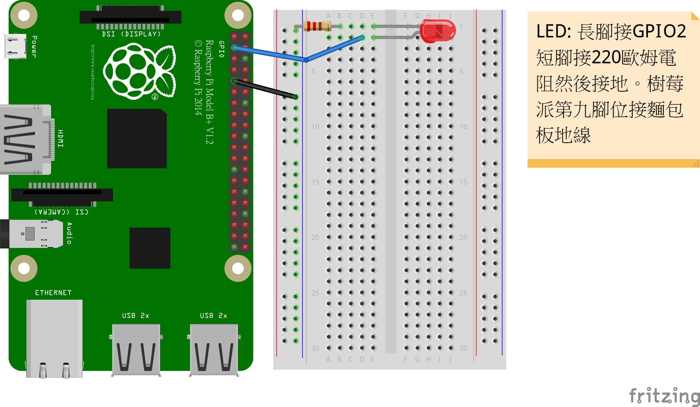

### 樹莓派腳位定義: source:[Raspberry Pi 2 & 3 個 Pin 對應](https://docs.microsoft.com/zh-tw/windows/iot-core/learn-about-hardware/pinmappings/pinmappingsrpi)

#
##
[程式:gpio_bcm.py](gpio_bcm.py)
### 必要模組:
* pip3 install RPi.GPIO
### 執行:
* sudo python3 gpio_bcm.py
##

* [A People Counter with Raspberry Pi and Ubidots](https://www.hackster.io/ubimaker/a-people-counter-with-raspberry-pi-and-ubidots-2b53be)
